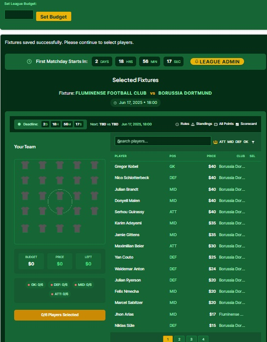
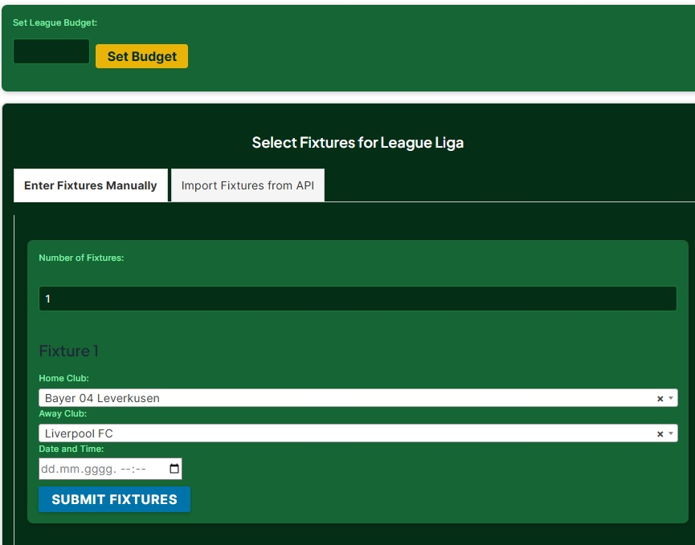
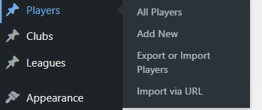
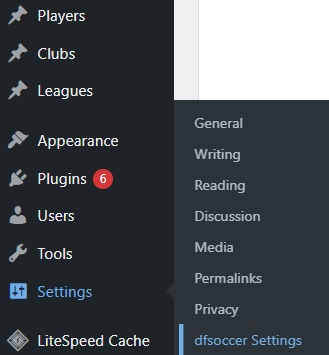
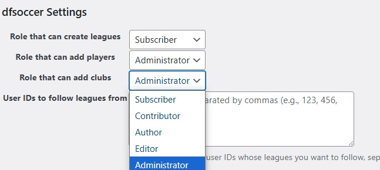

# DFSoccer Plugin

**Contributors:** (h3rzzz)  
**Tags:** fantasy soccer, custom leagues, custom players, player management, league management, soccer stats, CSV import, CSV export, fantasy sports, soccer plugin, fantasy football, performance rules, fixture management, points calculation  
**Requires at least:** 4.6  
**Tested up to:** 6.5  
**Stable tag:** 1.0  
**Requires PHP:** 5.6  
**License:** GPLv2 or later  
**License URI:** GPLv2 License

DFSoccer is a versatile WordPress plugin that transforms any event into a fantasy soccer league. 
It supports custom leagues, players, and fixtures, and includes features for CSV import/export and performance-based scoring. 
Whether for major events like the Champions League or casual backyard games, DFSoccer offers comprehensive management and scoring tools.

> **🎮 [Try Live Demo](https://superfantasy.net/)** - See DFSoccer in action before you install!



*Main DFSoccer plugin dashboard showing league overview and navigation*


## Description

DFSoccer allows you to create and manage fantasy soccer leagues with ease. Key features include:

**Customizable Leagues:** Set up leagues for any event, big or small, with the ability to include custom players and teams.

**Dynamic Scoring:** Enter real-world game results, and the plugin will automatically calculate points, rank participants, and determine the top fantasy managers.

**User-Generated Content:** Enable subscribers to create their own teams, players, and leagues, with admin-controlled permissions.

## Installation

1. Upload the dfsoccer plugin folder to the `/wp-content/plugins/` directory.
2. Activate the plugin through the 'Plugins' menu in WordPress.

## Usage

### Setting Up a Fantasy League

**Access the Admin Dashboard:**
Log in to your WordPress admin dashboard.

**Create a New League:**
1. Go to the "Leagues" section and click "Add New."
2. Enter a title for your league (e.g., "Champions League Finals") and save.
3. Edit the league post and select the "Fixtures" option.
4. Choose the date and teams for each fixture.




**Pick Your Team:**
Participants can select up to six players.

**Enter Results:**
Only league admins can enter match results and set point rules for each league, including how many points players receive for goals, assists, minutes played, and other performance metrics. The plugin calculates points based on player performance and updates standings.

### Creating Players and Leagues

1. Go to the WordPress dashboard menu.
2. Click on 'Add New Player' to create a player.
3. Click on 'Add New League' to create a league.




### Importing and Exporting Players via CSV

**Export Players:** Go to 'Players' and click 'Export Players' to download a CSV file.

**Import Players:** Go to 'Players' and click 'Import Players' to upload a CSV file.

When importing players via CSV file, make sure that you use this format:
```
Title,Position,Price,Club
"Leroy Sané ","midfielder","70.000","Bayern Munich"
```

### Setting Custom Performance Rules

1. Edit the league post.
2. Set performance rules for metrics such as goals scored and assists.
3. Save your changes.

### Managing Fixtures and Player Stats

- Only league creators can manage player stats and rules.
- For fixtures, create or edit a league post and go to 'Fixtures.'
- To enter player stats, go to 'Home Team Players' or 'Away Team Players' within the league post.

## Point Management System

The plugin features a flexible point management system that allows administrators to control how points are distributed to participants in leagues.

### Point Distribution Methods

The system offers three different distribution methods to suit various league formats:

**Tiered Distribution (Based on Participants)**
This method automatically adjusts point distribution based on the number of league participants. The system scales rewards proportionally - larger leagues offer more points to winners, while smaller leagues provide modest but fair rewards.

**Fixed Distribution**
Administrators have complete control over point allocation by manually setting specific point values for each placement:
- First place: Custom point value
- Second place: Custom point value  
- Third place: Custom point value

This method works well for leagues where you want consistent, predictable rewards regardless of participant count.

**Winner Takes All**
In this high-stakes format, the league winner receives points equal to the total number of participants in the league. For example, if 20 players join a league, the winner receives 20 points while other participants receive nothing.

### User Role Permissions

Administrators can customize which user roles have permission to create and manage different aspects of the system:

**Configurable Permissions by Role:**
- Subscribers
- Authors  
- Contributors
- Other WordPress user roles





**Available Permissions:**
- Create new leagues
- Add players to the system
- Create and manage clubs

This role-based system ensures proper access control while allowing flexibility in how your community participates in league management.

### Point Transfer System

Users can send points to each other, creating opportunities for:
- Rewarding helpful community members
- Creating informal betting or trading systems
- Building social engagement within your leagues

## SuperFantasy Integration

For users who want to get started quickly without the hassle of manually creating players and leagues, the plugin includes integration with SuperFantasy.net.

### Easy League Setup

The plugin currently offers a hardcoded option that allows you to select and import leagues directly from the SuperFantasy API (https://superfantasy.net/). This feature is perfect for:
- Users who don't want to spend time creating extensive player databases
- Quick setup and testing of the plugin functionality
- Access to professionally maintained player data

### Enhanced Workflow with SuperFantasy Pro

SuperFantasy offers a Pro version that significantly streamlines player statistics management. The recommended workflow is:

1. **Create your league on SuperFantasy.net** - Use their Pro tools for easy player stat entry
2. **Import the league into your WordPress site** - Load the complete league data through the plugin
3. **Manage locally** - Run your league on your own WordPress installation with all the custom point rules and user management features

This hybrid approach gives you the best of both worlds: SuperFantasy's efficient stat management tools combined with your WordPress site's custom point distribution system and community features.

**Benefits of this approach:**
- Simplified player statistics entry through SuperFantasy Pro
- Reduced setup time for new leagues  
- Professional player database maintenance
- Full control over your community and point system on your WordPress site

## Available Shortcodes

### Display All Available Leagues
```
[df-fantasy-combined]
```
Shows a complete list of all active leagues that users can join.

### Points Leaderboard
```
[custom_soccer_leaderboard limit="15" title="Top Players"]
```
Displays the top point holders across your entire system. Users can earn points by winning leagues or receiving transfers from other users.
- `limit`: Number of users to display (default: 15)
- `title`: Custom heading for the leaderboard

### User Points Display
```
[dfsoccer_points show_history="yes"]
```
Shows the current logged-in user's point balance and optionally their point history.
- `show_history="yes"`: Includes a detailed history of how points were earned or spent
- `show_history="no"`: Shows only current point balance

## Frequently Asked Questions

**Q: How do I update player stats?**
A: Only league creators can update player stats.

**Q: Can I set different performance rules for different leagues?**
A: Yes, each league can have custom performance rules.

**Q: How do I export/import player data?**
A: Use the 'Export Players' and 'Import Players' options in the 'Players' menu.

**Q: Do I need to create all players manually?**
A: No, you can use the SuperFantasy.net integration to import leagues with pre-made player databases, or import players via CSV files.

**Q: Can users transfer points to each other?**
A: Yes, the plugin includes a point transfer system that allows users to send points to other community members.

## Changelog

### 1.0
- Initial release

## Upgrade Notice

### 1.0
Initial release

## License

This plugin is licensed under the GPLv2 license or later. [More information](http://www.gnu.org/licenses/gpl-2.0.html).